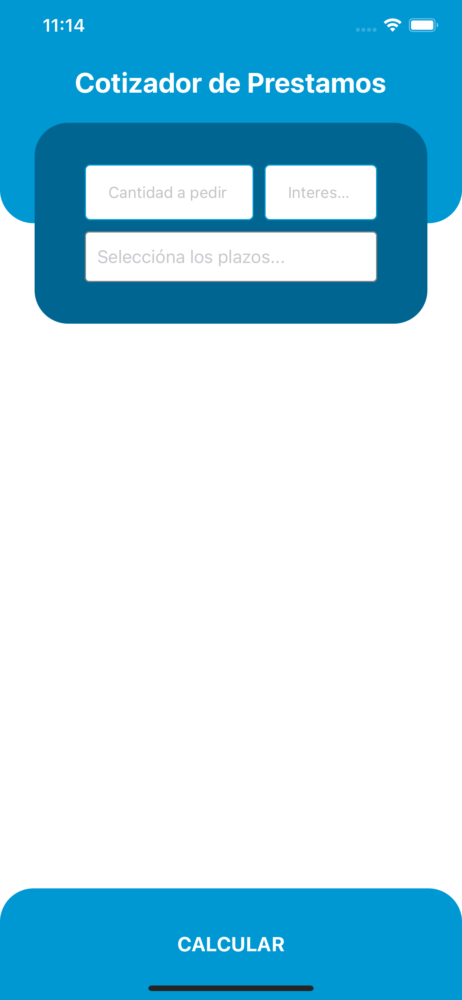
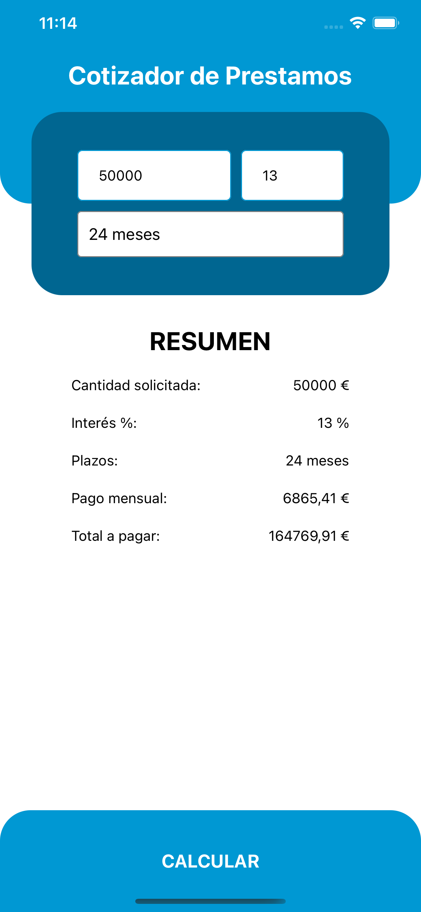

# Loan Quote

Simple App created with React Native to simulate a loan quote. In this app you can introduce the amount you want, the interest (%) and in how many month. It will give you the result of the total you will pay and how will you pay monthly.

## Development server

Run `yarn start` for a dev server. Navigate to `http://localhost:19002/`. The app will automatically reload if you change any of the source files.

## Design

### Home

### Add birthday

